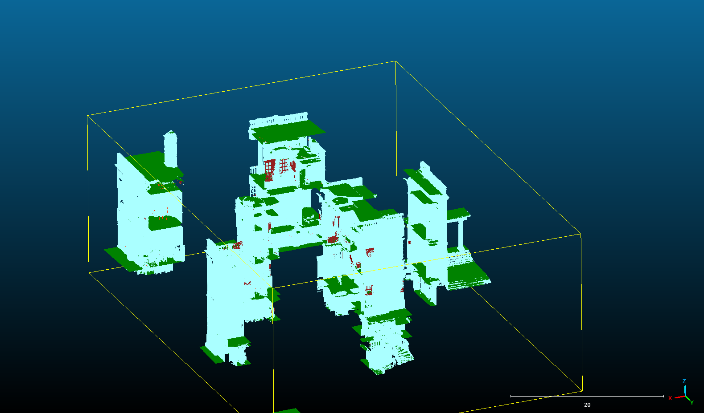

# Example inference with QH data

In this doc we'll briefly explain how to run inference on heritage data using the scannet PTv3+PPT model.

NOTE: all commands should be run from the pointcept root directory!

### Preprocessing 1: convert to .pth

Let's say we have training data from the previous project, in my case at `/data/sdd/training_v2_subsampled_centroid_0.02.las` with a 2cm sampling.

We first need to convert this to a pytorch state dict as Pointcept expects.

To do this we can use `tools/convert_las.py`

```
usage: convert_las.py [-h] [--num_points NUM_POINTS] [--spoof_normal] [--no_spoof_normal] [--spoof_gt] [--no_spoof_gt] [--print_contents]
                      [--no_print_contents]
                      input_las_path category scene_id

Process LAS files into numpy .pth format.

positional arguments:
  input_las_path        Path to the input LAS file.
  category              Category of the input LAS file.
  scene_id              Scene ID of the input LAS file.

options:
  -h, --help            show this help message and exit
  --num_points NUM_POINTS
                        Number of points to process (optional).
  --spoof_normal        Whether to spoof normals (default: True).
  --no_spoof_normal     Do not spoof normals.
  --spoof_gt            Whether to spoof ground truth labels (default: True).
  --no_spoof_gt         Do not spoof ground truth labels.
  --print_contents      Whether to print contents (default: True).
  --no_print_contents   Do not print contents.
```

For example,

```bash
$ python tools/convert_las.py /data/sdd/training_v2_subsampled_centroid_0.02.las qh training_slice
```

where `qh` is the category of data, and `training_slice` is the "scene ID" to help break apart larger datasets into more manageable chunks of inference. These just control what directories the converted data is placed in.

Once that is run, we have

```bash
$ ls data/qh -l
total 602516
-rw-r--r-- 1 sogilvy users 616972604 Jul 24 21:28 training_slice.pth
```

### Preprocessing 2: prepare data, optionally voxelize

Now, even this slice of training is very large for a typical pointcept scene. If you're not running this on a powerful cluster, and instead on a personal computer with a modest amount of RAM and CPU cores, it's best to split this up into voxels for inference.

We do this with `tools/setup_data.py`

```bash
usage: setup_data.py [-h] [--name_tag NAME_TAG] [--num_voxels_x NUM_VOXELS_X] [--num_voxels_y NUM_VOXELS_Y] [--num_voxels_z NUM_VOXELS_Z]
                     [--print_contents] [--no_print_contents]
                     input_pth_filename category

Process .pth files into partitioned voxel directories.

positional arguments:
  input_pth_filename    Filename of the input .pth file.
  category              Category of the input .pth file.

options:
  -h, --help            show this help message and exit
  --name_tag NAME_TAG   Optional name tag for the output directory.
  --num_voxels_x NUM_VOXELS_X
                        Number of voxels along the x-axis (optional).
  --num_voxels_y NUM_VOXELS_Y
                        Number of voxels along the y-axis (optional).
  --num_voxels_z NUM_VOXELS_Z
                        Number of voxels along the z-axis (optional).
  --print_contents      Whether to print the contents of the operation (default: True).
  --no_print_contents   Do not print the operation contents.
```

Note that the number of voxels is optional. This will prepare the data and place it in the expected data structure, e.g.

```python
python tools/setup_data.py data/qh/training_slice.pth qh --num_voxels_x 4 --num_voxels_y 4 --num_voxels_z 3
```

This is the amount of voxelization required for a smooth inference run on my personal device (32GB of RAM with a 40GB swap space).

```bash
ls data/qh -l
total 602516
-rw-r--r-- 1 sogilvy users 616972604 Jul 24 21:28 training_slice.pth
drwxr-xr-x 1 sogilvy users        24 Jul 24 20:09 training_slice_voxels_4x4x3

$ ls data/qh/training_slice_voxels_4x4x3/val/ -l
total 602636
-rw-r--r-- 1 sogilvy users 28960684 Jul 24 20:09 training_slice_voxel_0_1_0.pth
-rw-r--r-- 1 sogilvy users 35102764 Jul 24 20:09 training_slice_voxel_0_1_1.pth
-rw-r--r-- 1 sogilvy users 11888236 Jul 24 20:09 training_slice_voxel_0_1_2.pth
-rw-r--r-- 1 sogilvy users  1706732 Jul 24 20:09 training_slice_voxel_0_2_0.pth
-rw-r--r-- 1 sogilvy users  1330732 Jul 24 20:09 training_slice_voxel_0_2_1.pth
...
...
-rw-r--r-- 1 sogilvy users  2659436 Jul 24 20:09 training_slice_voxel_3_3_0.pth
```

## Running Inference

Now you need to use take the template config file at `test/qh_template.py` and tweak the opening few lines
to produce a config file Pointcept can use.

Its head looks like this:

```python
###############################################################################################
# Custom config here.
my_data_root = "./data/qh/training_slice_voxels_4x4x3"

# Where you want the results saved.
# WARNING: if this dir already exists, Pointcept will fail with a very esoteric error!
save_path = 'exp/qh/training_slice_voxels_4x4x3/semseg-pt-v3m1-1-ppt-extreme'

###############################################################################################
# Pointcept config below here.
weight = 'models/PointTransformerV3/scannet-semseg-pt-v3m1-1-ppt-extreme/model/model_best.pth'
resume = False
evaluate = False
...
...
```

Copy this to a new .py file, e.g. `my_config.py` and change my_data_root to be where your processed data lives, and change save_path as appropriate.

Now, you're ready to run inference.

```bash
python tools/test.py --config-file my_config.py
```

and Pointcept should do its thing.

## Producing .las files with the results for visualisation

The inference results will be saved in your `save_path` in a subdir called `results` in the form of numpy files containing the inferred category arrays.

We have a script to combine your prepared scene with the results at `tools/prepare_inference_las.py`.

```bash
usage: prepare_inference_las.py [-h] [--output_dir OUTPUT_DIR] scenes_dir results_dir

Create LAS files from scenes and results directories and optionally store them in a specified output directory.

positional arguments:
  scenes_dir            Directory containing the scene files.
  results_dir           Directory where the results should be stored.

options:
  -h, --help            show this help message and exit
  --output_dir OUTPUT_DIR
                        Optional directory where the LAS files should be output.
```

So for example, using the template configuration, and say if I want to save the resulting .las files under `/data/sdd/qh_test_results/`, I can run

```bash
python tools/prepare_inference_las.py data/qh/training_slice_voxels_4x4x3/val exp/qh/training_slice_voxels_4x4x3/semseg-pt-v3m1-1-ppt-extreme/result --output_dir=/data/sdd/qh_test_results/
```

If no output dir is specified, the results will be saved in the current working directory, which as a reminder must be the pointcept root dir.

After running this the .las files are located in the output dir, and can all be opened collectively in Cloudcompare or your visualisation software of choice for inspection:


*Figure 1: example inference on the QH dataset at a 2cm sampling resolution.*
