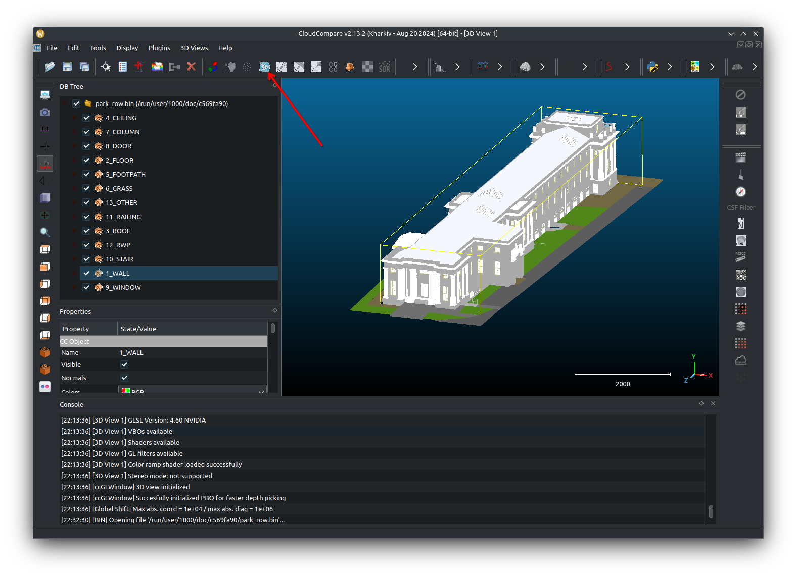
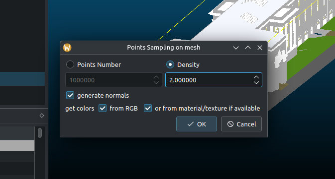
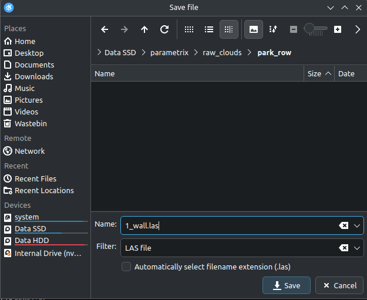
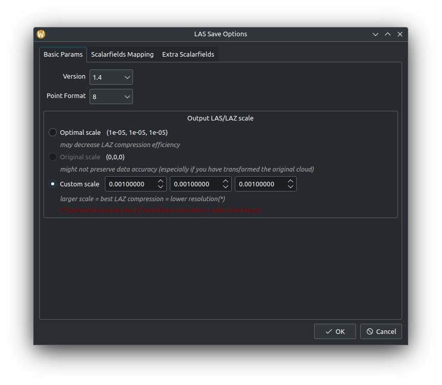

# Data pipeline

This document describes how to take the .bin files containing the raw HBIM meshes and to produce data
that Pointcept can use in training, testing, and evaluation.

The `.bin` format is a proprietary CloudCompare format, and so third party libraries for reading it are somewhat sparse.
As such, we do a very minimal mesh sampling and export in the CloudCompare GUI itself.

We then hand over to a custom script that invokes PDAL to preprocess the .las files and produce .pth files that Pointcept can directly use.

## Part 1: Directory Management

Aleks has supplied a .zip file containing the `.bin` files with the HBIM meshes for each project.

I've prepared a root directory to contain all the data, `/data/sdd/parametrix` in this example.

The first step is to extract this and rename these files to be more Linux-friendly, and place them in a directory called `meshes` under the root data dir:

```bash
/data/sdd/parametrix $ tree meshes
meshes
├── brass_foundry.bin
├── library.bin
├── maritime_museum.bin
├── park_row.bin
├── rog_north.bin
├── rog_south.bin
└── site.bin
```

## Part 2: CloudCompare Exports

We'll use `park_row.bin` as an example here. Open the file up in CloudCompare.
The meshes are grouped by category.

Select `1_WALL` and hit the button indicated on the screenshot to "Sample points on a mesh".



On the dialogue box that pops up, select "density" and input a density of 2.0. Ensure all other boxes are ticked, and hit OK. This can take some time.



This will produce an entity in CloudCompare called `1_WALL.sampled`. Click it then click the "Save current entity" button, the icon of the single floppy disc.

Now create the following directories under the root:

`./raw_clouds/park_row`

Then in CloudCompare, select this directory and call your file `1_wall.las`, which when you hit "Save" will trigger the .las save options dialogue *provided you also give the `.las` extension`.



Important: *ensure the Version is 1.4, and the Point Format is 8.* Otherwise the resultant .las file may be missing RGB or scalar field information further in the processing chain.
There is no need to change any other tab options, hit OK.
This can take some time.



Once it has been saved, you can safely delete the `1_WALL.sampled` entity to clear it from RAM, and move onto the next one.

Note that sampling settings persist between operations, but the .las dialogue resets its Version and Point Version each time.

Once you're finished, it should look like this:

```bash
/data/sdd/parametrix $ tree raw_clouds/park_row
raw_clouds/park_row
├── 10_stair.las
├── 11_railing.las
├── 12_rwp.las
├── 13_other.las
├── 1_wall.las
├── 2_floor.las
├── 3_roof.las
├── 4_ceiling.las
├── 5_footpath.las
├── 6_grass.las
├── 7_column.las
├── 8_door.las
└── 9_window.las

1 directory, 13 files
```

# Part 3: PDAL pipeline script

The PDAL pipeline script is located in the Pointcept repo under `./hbim_processing/process_raw_las.py`.

```bash
$ python ~/repos/Pointcept/hbim_processing/process_raw_las.py -h
usage: process_raw_las.py [-h] [--capacity CAPACITY] dataset resolution

Process point cloud data using PDAL.

positional arguments:
  dataset              The dataset tag to process, e.g., 'park_row'
  resolution           The resolution to use in subsampling.

options:
  -h, --help           show this help message and exit
  --capacity CAPACITY  The capacity for each train/test split, default is 2.4 million.
```

For resolution, this should be in meters as we've been doing so far.
0.05m or 0.02m should be good starting points for our training task.

Capacity should be whatever the GPU/RAM of the system can handle to be loaded into Pointcept in a single file.

This script does the following:

1. Generates required directories, then subsamples the finely sampled individual category clouds to the required resolution.
2. Runs a transform to convert the cloud from centimeters to meters.
3. Runs a transform to switch the Y and Z axes.
4. Adds a new scalar field "gt" for the ground truth and assigns the relevant index for each cloud.
5. Writes the intermediate subsampled clouds for each category to temporary files.
6. Runs a merger on these files, and then deletes the intermediate subsampled files (using intermediate files prevents your RAM from blowing up, as some individual category clouds are dozens of GB in size).
7. Then, the merged and processed .las file is then split with a PDAL chipper filter. This partitions the .las file into splits than can be used in training and testing, and when assigned the correct `capacity` should allow for the whole file to be fed into Pointcept for inference/training/testing etc.
8. Each of these files is then converted into a .pth format with the relevant information for Pointcept.

Here's what a sample output looks like for 5cm resolution with Park Row:

```bash
/data/sdd/parametrix $ python ~/repos/Pointcept/hbim_processing/process_raw_las.py park_row 0.05
Configuration Details:
------------------------------
Dataset Tag: park_row
Resolution: 0.05
Capacity: 2400000
------------------------------
Subsampling individual category clouds.
 - processing category: 1_wall
   - total points processed: 6017949
 - processing category: 2_floor
   - total points processed: 2226159
 - processing category: 3_roof
   - total points processed: 1271455
 - processing category: 4_ceiling
   - total points processed: 2093499
 - processing category: 5_footpath
   - total points processed: 1097113
 - processing category: 6_grass
   - total points processed: 280491
 - processing category: 7_column
   - total points processed: 474265
 - processing category: 8_door
   - total points processed: 258313
 - processing category: 9_window
   - total points processed: 325448
 - processing category: 10_stair
   - total points processed: 139211
 - processing category: 11_railing
   - total points processed: 92388
 - processing category: 12_rwp
   - total points processed: 14565
 - processing category: 13_other
   - total points processed: 117597
Merging categories...
Total points processed: 14408453
Created merged file: processed_clouds/resolution_0.05/park_row/park_row_merged.las
Removing intermediate split category .las files.
Running chipper with capacity=2400000...
 - chipper created 7 splits.
Converting split .las files to .pth...
- saved 2058350 points to processed_clouds/resolution_0.05/park_row/chipper_2400000/pth/park_row_split1.pth
- saved 2058351 points to processed_clouds/resolution_0.05/park_row/chipper_2400000/pth/park_row_split2.pth
- saved 2058350 points to processed_clouds/resolution_0.05/park_row/chipper_2400000/pth/park_row_split3.pth
- saved 2058351 points to processed_clouds/resolution_0.05/park_row/chipper_2400000/pth/park_row_split4.pth
- saved 2058350 points to processed_clouds/resolution_0.05/park_row/chipper_2400000/pth/park_row_split5.pth
- saved 2058351 points to processed_clouds/resolution_0.05/park_row/chipper_2400000/pth/park_row_split6.pth
- saved 2058350 points to processed_clouds/resolution_0.05/park_row/chipper_2400000/pth/park_row_split7.pth
Data pipeline complete!
------------------------------
```

The script has some limited idempotence, so if you decide that you need a smaller chipper capacity for your system, you can run the script again with the relevant command line arguments and it'll use the existing merged file.

```bash
/data/s/parametrix $ python ~/repos/Pointcept/hbim_processing/process_raw_las.py park_row 0.05 --capacity 1000000
Configuration Details:
------------------------------
Dataset Tag: park_row
Resolution: 0.05
Capacity: 1000000
------------------------------
Merged .las output already exists for this config. Skipping to chipper...
Running chipper with capacity=1000000...
 - chipper created 15 splits.
Converting split .las files to .pth...
- saved 960564 points to processed_clouds/resolution_0.05/park_row/chipper_1000000/pth/park_row_split1.pth
- saved 960563 points to processed_clouds/resolution_0.05/park_row/chipper_1000000/pth/park_row_split10.pth
- saved 960564 points to processed_clouds/resolution_0.05/park_row/chipper_1000000/pth/park_row_split11.pth
- saved 960563 points to processed_clouds/resolution_0.05/park_row/chipper_1000000/pth/park_row_split12.pth
- saved 960564 points to processed_clouds/resolution_0.05/park_row/chipper_1000000/pth/park_row_split13.pth
- saved 960563 points to processed_clouds/resolution_0.05/park_row/chipper_1000000/pth/park_row_split14.pth
- saved 960564 points to processed_clouds/resolution_0.05/park_row/chipper_1000000/pth/park_row_split15.pth
- saved 960563 points to processed_clouds/resolution_0.05/park_row/chipper_1000000/pth/park_row_split2.pth
- saved 960564 points to processed_clouds/resolution_0.05/park_row/chipper_1000000/pth/park_row_split3.pth
- saved 960563 points to processed_clouds/resolution_0.05/park_row/chipper_1000000/pth/park_row_split4.pth
- saved 960564 points to processed_clouds/resolution_0.05/park_row/chipper_1000000/pth/park_row_split5.pth
- saved 960563 points to processed_clouds/resolution_0.05/park_row/chipper_1000000/pth/park_row_split6.pth
- saved 960564 points to processed_clouds/resolution_0.05/park_row/chipper_1000000/pth/park_row_split7.pth
- saved 960563 points to processed_clouds/resolution_0.05/park_row/chipper_1000000/pth/park_row_split8.pth
- saved 960564 points to processed_clouds/resolution_0.05/park_row/chipper_1000000/pth/park_row_split9.pth
Data pipeline complete!
------------------------------
```

At the end of it all, your dir structure should look something like this:

```bash
data/sdd/parametrix $ tree
.
├── meshes
│   ├── brass_foundry.bin
│   ├── library.bin
│   ├── maritime_museum.bin
│   ├── park_row.bin
│   ├── rog_north.bin
│   ├── rog_south.bin
│   └── site.bin
├── processed_clouds
│   └── resolution_0.05
│       ├── park_row
│       │   ├── chipper_2400000
│       │   │   ├── park_row_split1.las
│       │   │   ├── park_row_split2.las
│       │   │   ├── park_row_split3.las
│       │   │   ├── park_row_split4.las
│       │   │   ├── park_row_split5.las
│       │   │   ├── park_row_split6.las
│       │   │   ├── park_row_split7.las
│       │   │   └── pth
│       │   │       ├── park_row_split1.pth
│       │   │       ├── park_row_split2.pth
│       │   │       ├── park_row_split3.pth
│       │   │       ├── park_row_split4.pth
│       │   │       ├── park_row_split5.pth
│       │   │       ├── park_row_split6.pth
│       │   │       └── park_row_split7.pth
│       │   └── park_row_merged.las
└── raw_clouds
    ├── park_row
    │   ├── 10_stair.las
    │   ├── 11_railing.las
    │   ├── 12_rwp.las
    │   ├── 13_other.las
    │   ├── 1_wall.las
    │   ├── 2_floor.las
    │   ├── 3_roof.las
    │   ├── 4_ceiling.las
    │   ├── 5_footpath.las
    │   ├── 6_grass.las
    │   ├── 7_column.las
    │   ├── 8_door.las
    │   └── 9_window.las
```

To use these in training, you can specify the `pth` dir in the Pointcept config to use it with the existing `ScannetDataset` functionality.

*To-do: create a bespoke Pointcept `Dataset` object that can take as args the relevant resolution and dataset labels to run on.*
