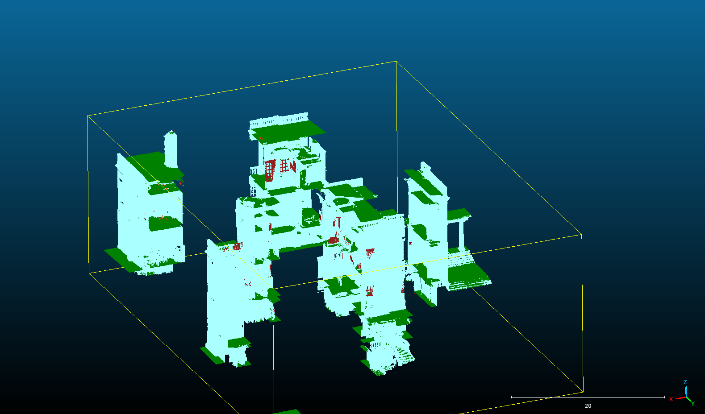

<p align="center">
    <!-- pypi-strip -->
    <picture>
    <source media="(prefers-color-scheme: dark)" srcset="https://raw.githubusercontent.com/Pointcept/Pointcept/main/docs/logo_dark.png">
    <source media="(prefers-color-scheme: light)" srcset="https://raw.githubusercontent.com/Pointcept/Pointcept/main/docs/logo.png">
    <!-- /pypi-strip -->
    
    <!-- pypi-strip -->
    </picture><br>
    <!-- /pypi-strip -->
</p>

<!-- [](https://github.com/pointcept/pointcept/actions/workflows/formatter.yml) -->

# Pointcept adaptation to heritage segmentation

# Install

Full instructions are in [the install markdown](INSTALL.md).

Basic instructions to run in a docker container are as follows.

First, we need access to the model weights on Pointcept's huggingface repository, so ensure you have an account there and also ensure you have an ssh agent running on your host machine with access to your ssh key.

Huggingface provides full instructions on how to do this:
- https://huggingface.co/docs/hub/en/security-git-ssh

Now we're ready to build the docker container and download the model weights git submodule.

```bash
$ make docker-env  # build the docker container
$ make ptv3-update # download or update the model weights submodule
```

Then to get into our container we can do

```
$ make enter-container
```

This will leave you at a bash prompt at the container's root application directory and ready to run preprocessing or inference.

The implementation uses docker-compose under the hood, so once you're done with the container and have exited it you can stop it with

```
$ docker-compose stop
```

# Preprocessing and Inference

Full instructions with examples are given in [the instructions markdown](INSTRUCTIONS.md).


