# Motivation 
This extension work built on the previous project where we found that LORA-adapted point transformer v3 models trained using 2-3 HBIM sites were able to perform semantic segmentation very well on parts of a building they had not seen, provided that they had seen some part of the building in the training process. It was found that their ability to generalise to sites they had not seen was more limited. We used the model trained on Maritime Museum and Park Row to perform inference on a test scene from the Brass Foundry site, and saw that the model's performance was low compared to the performance on unseen parts of MM/PR.

It was hypothesised that a model trained on more sites would be able to infer more general characteristics of heritage buildings, allowing for a heightened performance when performing inference on sites that the model had not seen. To this extent, we were supplied with HBIM data for the Queens House site, bringing the total models at our disposal up to 6:
- Queens House
- Park Row
- Brass Foundry
- Maritime Museum
- ROG North
- ROG South

This allowed us to use one site, Queens House, as our test case, and to train models using variable numbers of the other sites to explore the ability of models trained with this framework to generalise.

# QH HBIM Data
Shown below is the mesh data for the QH site, demonstrating the same basic colour data as was used for the other site, making this mesh data suitable for the generation of point clouds for ingestion into Pointcept.
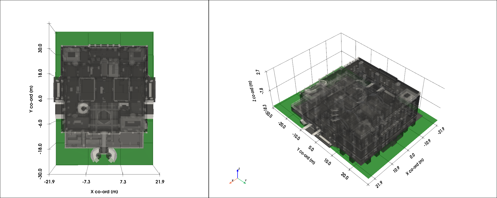

# Training configuration and hyperparameters
The models with higher numbers of input sites were exposed to more general data, and the training/network hyperparameters like the overall number of mini-batch epochs and learning rates required significant tweaking to ensure stable and convergent training.

We summarise the hyperparameters used below. The parameters are:
- **epochs**: the number of mini-batches taken *from each site*. This is why on higher site models the epochs are lower because one epoch is a lap around all the sites, so a lower listed Epoch value keeps the number of total mini-batches fed to the model more consistent. Keeping the epochs very high on 4/5 site models can result in instability as the model spends too much time at high learning rate before the annealing kicks in.
- **percentage ramp-up**: this is the period over which the training's learning rate ramps up to the peak Learning Rate at the very start of the training. The Scannet models we based the LoRA adaptations on used 5%, so we used these for the 2/3 site models initially (meaning the first 5% of the training has a ramp-up from a close-to-zero LR to the peak LR listed in the table). While exploring the hyperparams for the 4/5 site configs, we saw that this rampup didn't have much of an effect on the model's performance or the convergence of the training. As such, we reduced these values to 1% so that the training process took less time.
- **Learning Rate**: the 2/3 site models used the Scannet parameters, but we found when moving to higher numbers of sites, the input data is more complex, and higher learning rates result in the training being unstable. Lower learning rates leading to smaller adjustments to the model ultimately yielded stable and performant training.

| N Sites | Learning Rate | Percentage Ramp-Up | Epochs |
| ------- | ------------- | ------------------ | ------ |
| 2       | 0.003         | 0.05               | 2500   |
| 3       | 0.003         | 0.05               | 2500   |
| 4       | 0.0017        | 0.01               | 1700   |
| 5       | 0.0015        | 0.01               | 1250   |

For this project, the hyperparameters were tweaked manually given the low amount of manual work required. Ultimately, 8 configurations for the 4-site model and 10 configurations for the 5-site model were investigated before arriving at satisfactory evaluation performance and convergent training.

While this makes sense for training a small handful of models, when moving to scale, we'd definitely want to utilise automation tools such as Hyperband to automate this hyperparameter optimisation for a more economical solution.
https://arxiv.org/abs/1603.06560

As an example of what a convergent training looks like, we show some Tensorboard training metrics for the final version of our 4-site training. The mini-batch training results in a gradual improvement over time until we arrive at a very stable configuration with the evaluation set IoU performance ending up in the 61-64% range.

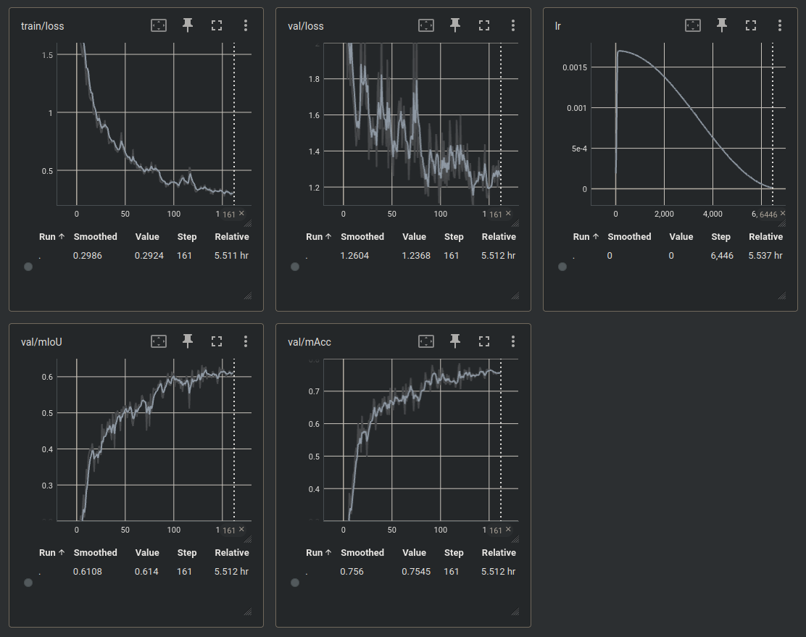

# Results: metrics

We'll present some confusion matrices and per-class metrics herein.

### 2 site (Maritime Museum/Park Row)
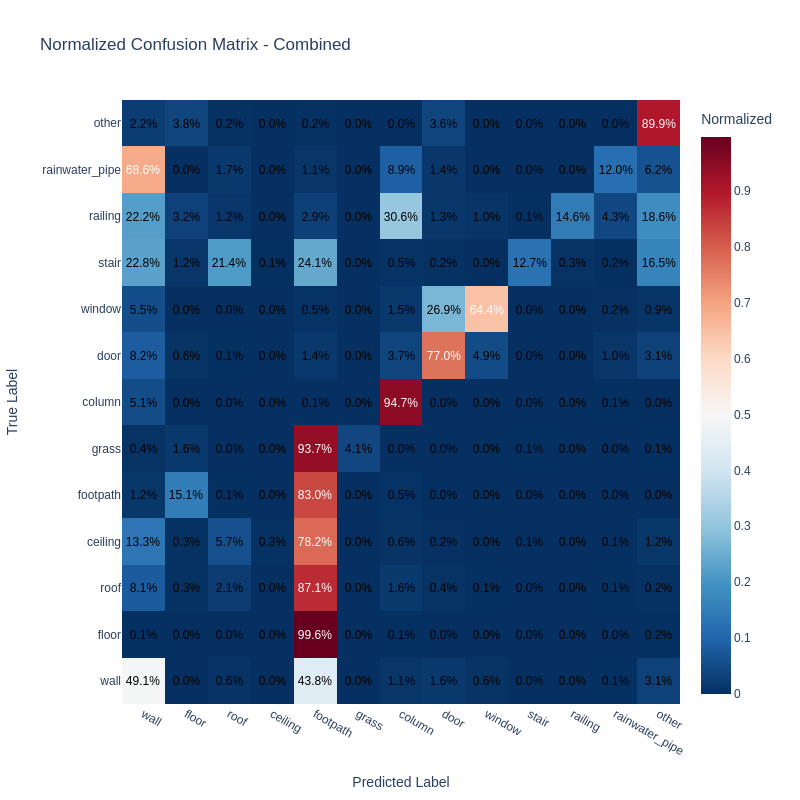
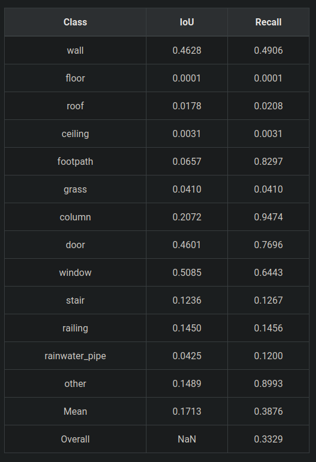

### 3 Site
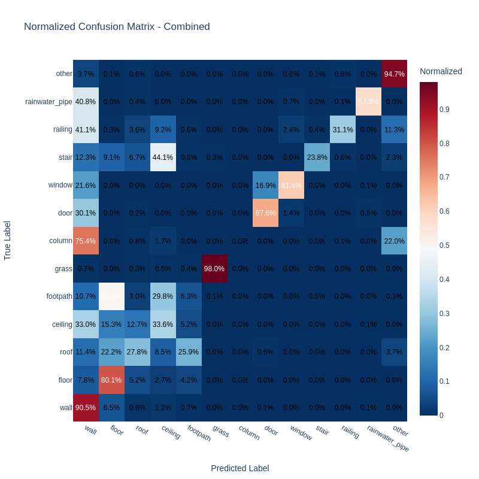
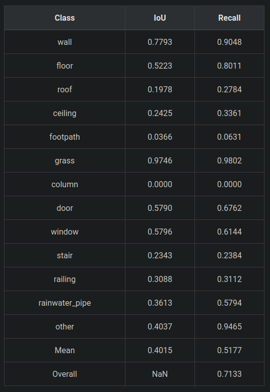

### 4 Site
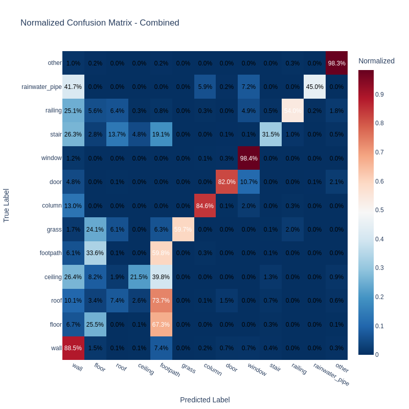
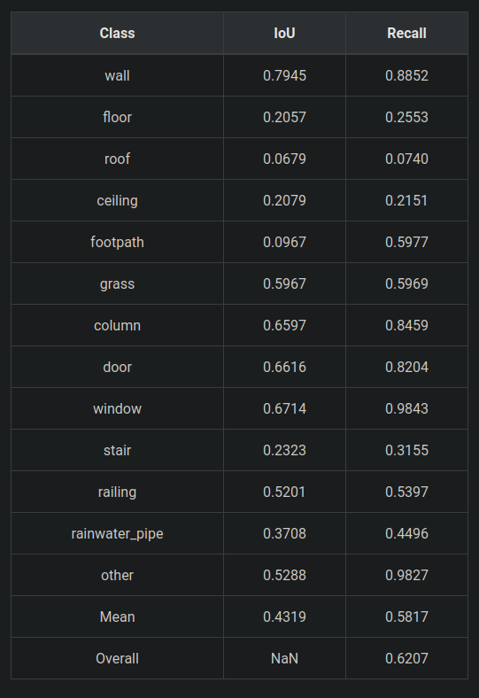

### 5 Site
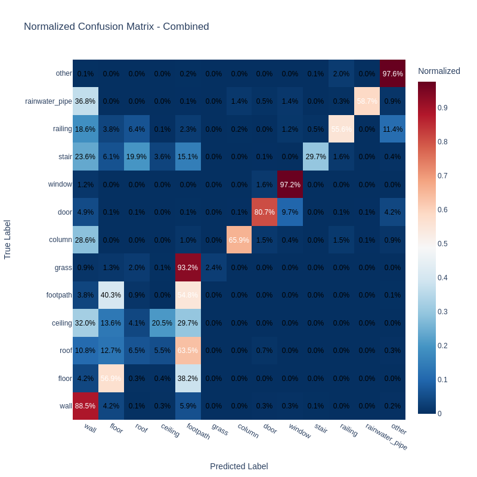
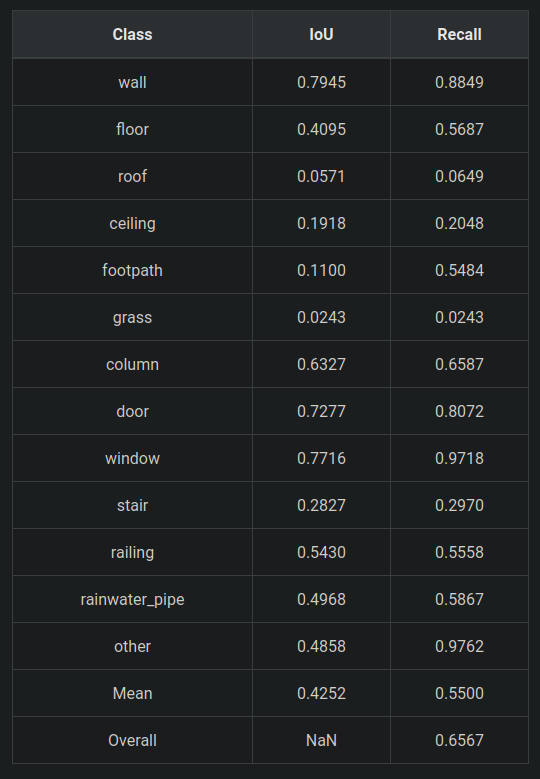

# Metrics summary and commentary

As can be seen from the above, the model's confusion metrics get steadily better as more sites are added, with the exception of the "flat" classes in the taxonomy that require more colour/material information to be properly resolved from one another.

Below we show the mean IoU, mean Recall, and overall Recall for the QH inference using each model.

We note that with the "flat" classes - floor, roof, ceiling, footpath, and grass - we are still lacking needed colour/texture contexts for these to be resolvable from one another.

However, where there are meaningful geometric differences in the mesh data between e.g. walls, windows, doors etc, there is a strong trend of improvement. In particular, for the mean IoU excluding flat categories, which is probably the most useful metric in demonstrating the model's ability to resolve the scenes properly, there is a steady upward trend as we add more sites.

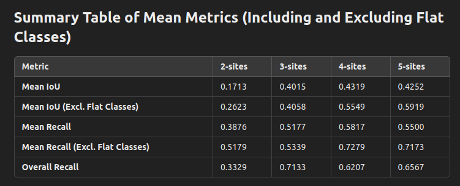

We note that in some cases, there are stronger-performing individual categories, particularly in the flat surfaces like grass. The 3-site model is better at using the primitive colour data for grass, which could be for a number of reasons - perhaps the LoRA weights are being more strongly shaped by more general geometric relationships in higher N-site models leaving less room for colour detail, for example.

The performance of the 5-site model in properly resolving the "non-flat" classes from each other is already markedly improved from where we left off the previous project, with mIoU of over 0.59. The model's ability to resolve walls, windows, doors, railings, and even the previously difficult rainwater pipe class is vastly improved from the 2/3 site models that were trained for the previous part of the project.

As an academic exercise, were we to re-classify the problem and put all the flat surface classes into one class and retrain, we'd probably see an even stronger performance separating the other classes from one another; the presence of these geometrically indistinct flat classes (and indeed often contextually indistinct classes, like the footpath that runs through the middle of the Queens House) will almost certainly introduce "noise" to the model's ability to infer the non-flat classes.

# Results: visualisations

To demonstrate the model improvement w.r.t N-sites, we include some visualisations. Full notebooks with all the visualisations can be found on our Proton drive.

## External Scene

### 2 site
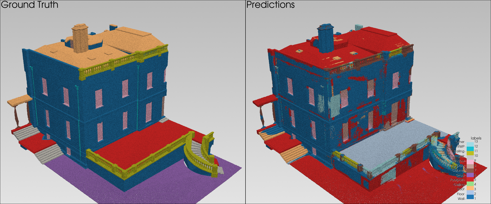

### 3 Site
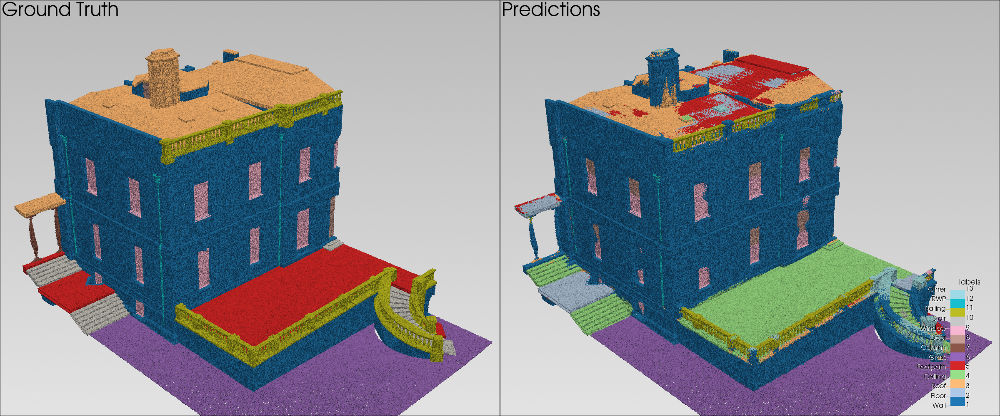

### 4 Site
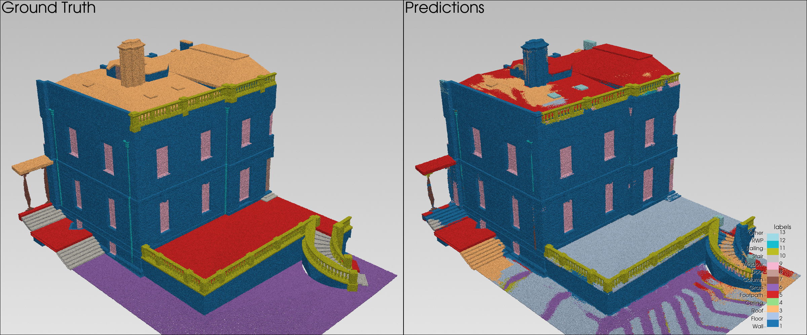

### 5 Site
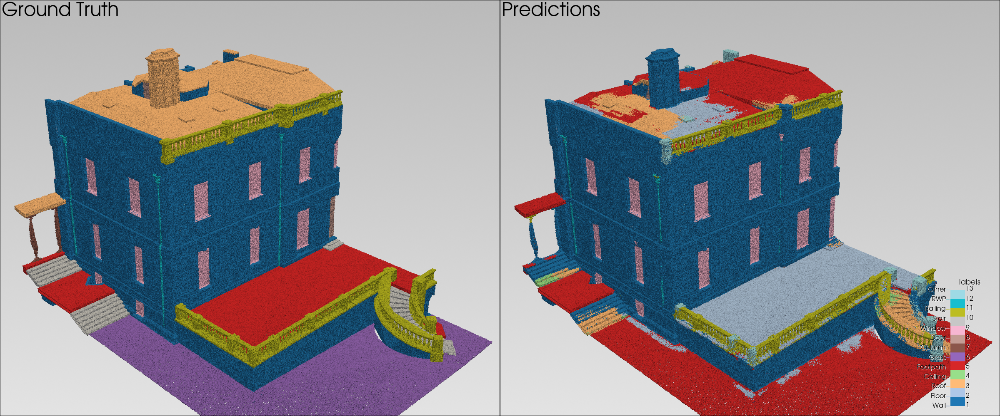

The visualisations clearly demonstrate an increased resolution of walls, windows, and railing going from 2/3 sites to 4/5.

At just 2 sites, the Wall elements are frequently confused for Other or even Footpath, reflecting what we saw with the inference on the LiDAR data inference from the previous project. With the addition of just a few more sites from which the model can generalise, we see an almost perfect recall for walls and windows.

At 5 sites, the RWP elements are even being quite strongly resolved despite their scarce population in the training data and the QH scene, indicating that our balanced approach to training by optimising the mean IoU is paying off.

We note that despite the external stair performance suffering because of the ambiguity of the flat classes, the internal stair elements are being very reliably resolved as stairs (see the predictions for the spiral staircase below being correctly marked in orange).

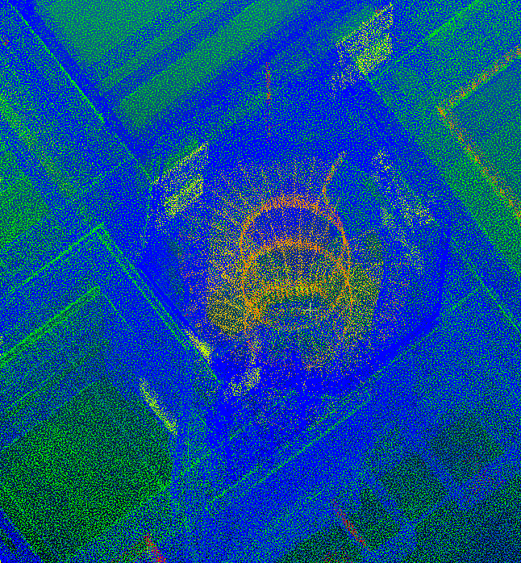

## Internal Scene

To highlight the improvement, we will compare an internal scene below going from the 2 site model to the 5 site model:

### 2 Site
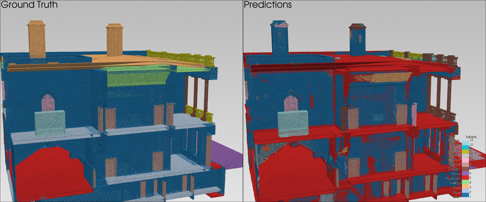

### 5 Site
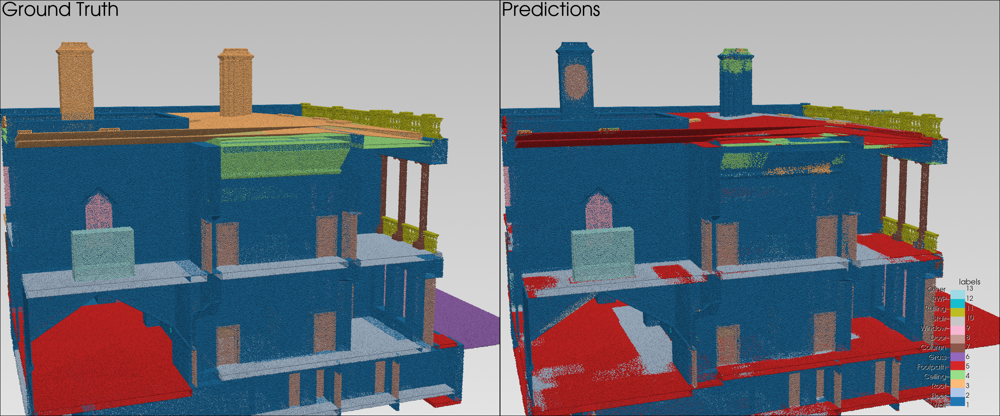

We note that the internal wall structures and doors are less noisy in their classification going to 5 sites from 2. We also note that while the 2 site model is incapable of resolving the railings and columns in this scene, the 5 site model does so almost perfectly.

# Conclusions

Based on the observed metrics, there is every reason to believe that with proper colour and texture information on the mesh surfaces, we could converge upon a product that can segment point clouds of buildings that have never been seen by the model with the specified taxonomy.

We're already at a point where 0.6 mIoU is being approached for the geometrically distinct (non-flat) classes for a building the model has never seen before, a very positive result.

We include a side-on shot of the full QH building in CloudCompare showing the ground truth and the 5-site model predictions:

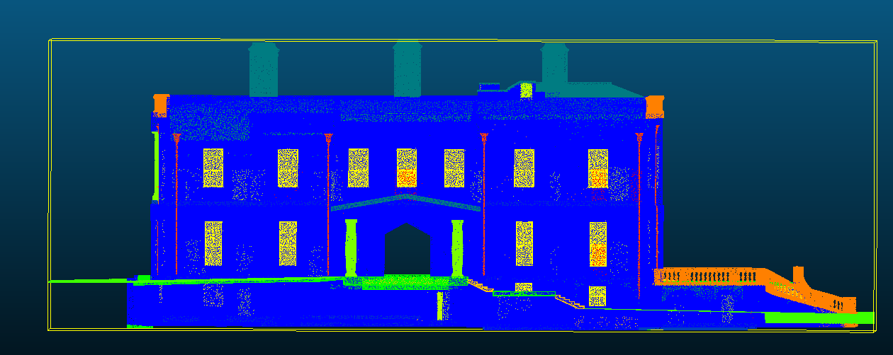  
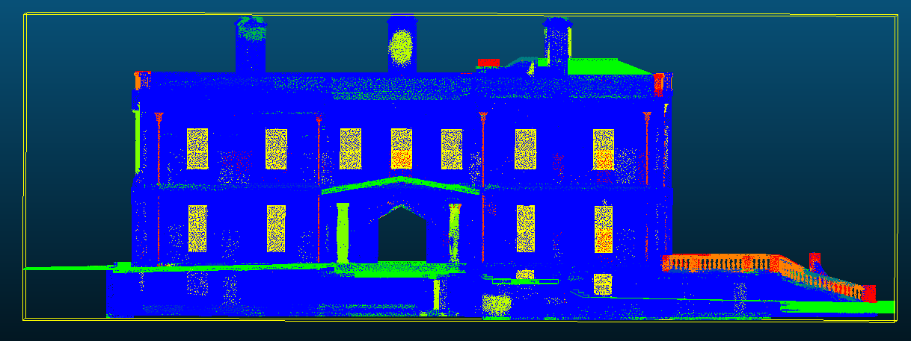

Side on, where the confusion of the flat elements is not so visible, the agreement between the two is remarkably improved from our earlier efforts.

The missing ingredient now remains a proper treatment of colour and local texture detail to aid with the separation of e.g. an asphalt roof from a carpeted floor, or a gravel walkway.

If that can be incorporated into the HBIM models we use for training, possibly with an expansion of the HBIM sites used in the training, it's very likely that we can converge on a robust product that can segment real LiDAR point clouds never before seen by the model with the desired recall and accuracy.
